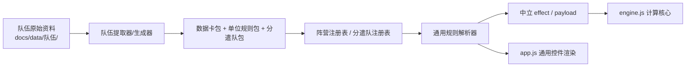

# 项目架构

本文只描述当前有效架构。为什么形成这些边界、曾经如何迁移，请查看 Git 历史和 `docs/plans/`；不要把演进过程继续追加到本文。

## 架构目标

新增或大规模更新一个队伍时，改动应停留在该队伍的资料、数据卡、规则和分遣队包内。帝皇禁军、星际战士、死亡守卫等既有队伍的生成物不得被顺带重写，计算核心不得通过技能中文名判断行为。



依赖只能沿箭头方向流动。`engine.js` 不认识队伍、数据卡或技能名；队伍包也不能绕过公共 effect 契约直接修改引擎状态。

## 分层与职责

| 层 | 当前入口 | 只负责 |
| --- | --- | --- |
| 原始资料 | `docs/data/<队伍>/` | PDF、可检索文本、勘误依据；PDF 由 `.gitignore` 排除 |
| 数据卡 | `docs/data/<队伍>/*.json` | 模型属性、武器、关键词、原文能力 |
| 单位规则包 | `docs/rules/<faction>.js` | 该队独有技能到公共 effect 的声明式映射 |
| 分遣队包 | `docs/rules/detachments/<faction>.js` | 该队分遣队、计谋、增强及其公共 effect |
| 身份层 | `identity.js`、各队 `*-identities.js` | 稳定 ID、别名和外部英文身份 |
| 注册层 | `faction-registry.js`、`detachment-registry.js`、`factions.js` | 安装队伍包并解析队伍别名 |
| 语义层 | `effect-schema.js`、`effects.js`、`resolver.js` | 校验、筛选并归约公共效果 |
| 战斗边界 | `payload-schema.js`、`combat-state.js` | 把 UI/军表状态转换为中立计算载荷 |
| 计算核心 | `engine.js` | 只执行通用骰子、武器词条、伤害和承伤算法 |
| UI | `app.js`、`index.html`、`styles.css` | 从 schema/规则控件渲染选择项和结果，不按技能名分支 |

## 队伍包契约

每个队伍使用稳定 `factionId`。数据卡、单位规则、分遣队、计谋和增强都必须使用稳定 ID；中文名和英文名只用于显示与导入匹配，不能成为行为契约。

队伍独有规则通过以下字段表达：

- `effects`：一个或多个公共语义效果，如 `hit-modifier`、`wound-reroll`、`fnp`。
- `controls`：玩家需要明确选择的条件；UI 按通用控件类型渲染。
- `phase`、`direction`、目标/武器限制：限定效果何时、对谁生效。
- `status`：无法安全进入伤害计算的规则明确标记为仅供查阅。

不得在 `app.js`、`resolver.js` 或 `engine.js` 中写“如果技能名等于某中文字符串”。改名只能影响显示和别名，不得改变计算。

## 分遣队与增强

分遣队生成物按队伍物理隔离：

- `docs/rules/detachments/adeptus-custodes.js`
- `docs/rules/detachments/space-marines.js`
- `docs/rules/detachments/death-guard.js`

`detachment-registry.js` 按 `factionId` 注册包，`resolver.js` 只读取当前队伍。使用 `node tools/generate-detachment-rules.mjs --faction=<factionId>` 时只改写该队生成物和该队 ID 复核表。

增强只能分配给角色。联合单位可有多个角色，每个角色独立持有零个或一个增强，护卫不出现增强选择器。增强还必须声明：

- `effectScope: "owner"`：只作用于持有增强的角色模型；不会泄漏给护卫或其他角色。
- `effectScope: "unit"`：原文明确写“所在单位”“所领导的单位”或等价表述时，作用于整个联合单位；归约时只应用一次。

作用域由规则原文决定，不能因为 UI 中角色和护卫处于同一个单位就自动共享。

## 通用规则与队伍规则边界

规则书定义的武器词条和骰子流程属于公共层，例如速射、热熔、连击、致命一击、曲射、手枪和额外攻击。它们进入 `keyword-dictionary.js`、公共 effect 或引擎，不得复制到某个队伍包。

禁军武艺、队伍数据卡技能、队伍分遣队规则属于队伍包。若新队伍只组合已有公共语义，正常接入不应修改 `engine.js`、`effects.js`、`resolver.js` 或全局 UI。

若原文要求当前公共语义无法表达的新机制，应停止资料接入并向维护者报告：原文、预期骰子步骤、作用方向、阶段、范围、与既有效果的叠加关系，以及建议新增的中立 effect。批准后先扩展公共契约和跨队测试，再继续队伍数据。不得在队伍包内用临时代码绕过。

## 运行时隔离

- 军表实例、计算方、单位 ID 共同组成草稿状态键；同阵营内战的同名单位不会共享分遣队或选择状态。
- `faction-registry` 只解析当前队伍的单位别名和标签。
- `detachment-registry` 只返回当前 `factionId` 的分遣队。
- 联合单位先分别解析成员的 `owner` 效果，再把 `unit` 效果归约一次。
- 防守效果先进入中立 payload；重投 UI 使用所有攻防修正后的有效阈值，不从技能名推断颜色。

## 新增队伍的正常改动面

正常新增队伍只应包含：

1. `docs/data/<队伍>/` 中的原始资料和结构化数据。
2. 该队身份文件、单位规则文件和分遣队生成文件。
3. `factions.js` 中一条注册记录，以及 `index.html` 中加载该队包的脚本声明。
4. 该队提取器或生成配置、该队审计报告和测试夹具。

第 3 项是安装入口，不允许包含规则计算逻辑。完整提取步骤见 [资料提取.md](资料提取.md)，审核要求见 [审核机制.md](审核机制.md)。

## 必跑门禁

```powershell
node tools/generate-faction-identities.mjs
node tools/generate-detachment-rules.mjs
node tools/validate-datasheets.mjs
node tools/validate-rules.mjs
node tools/validate-detachments.mjs
node tools/validate-combat.mjs
node tools/validate-architecture.mjs
node tools/validate-40k-app.mjs
node --check docs/app.js
node --check docs/engine.js
```

新增队伍还必须证明：只生成该队时，其他队伍生成文件的哈希不变；只选择该队规则时，其他队伍解析结果为空。
